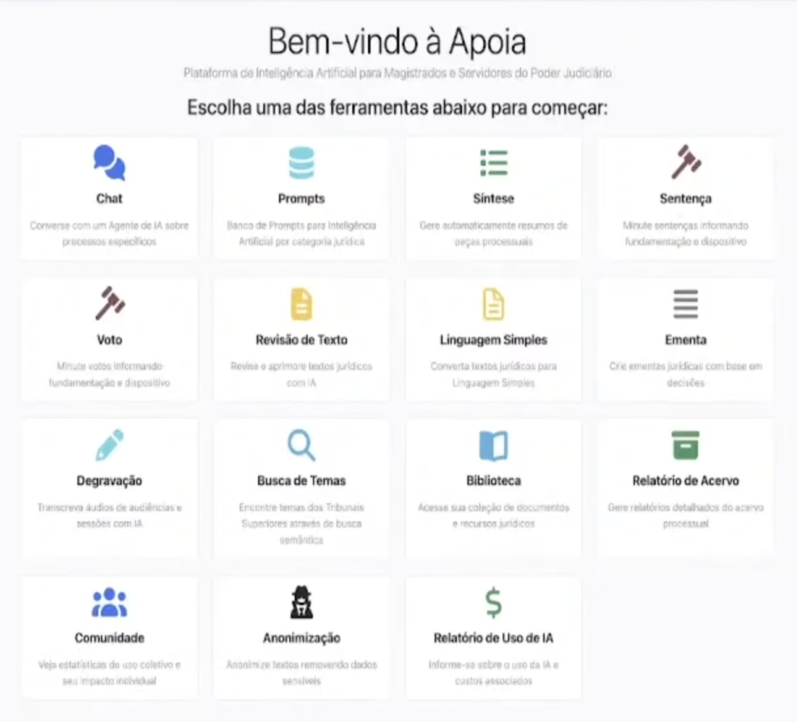
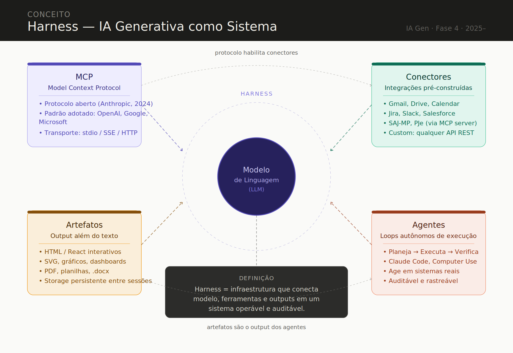

---

marp: true
theme: default

---

# A IA NA PROMOTORIA DE JUSTIÇA
## Estratégias e limitações
..................................................................
**José Eduardo de Souza Pimentel**
XXIV Encontro Formativo do NAT
29/05/2026

---

## Slides da palestra

https://jespimentel.github.io/nat2026/

---

# Agenda

- IA Gen: visão geral
- IA Gen e Judiciário
- IA Gen no MPSP
	- Tilene
	- Transcreve MPSP
	- **M365 Copilot** 
- "Engenharia de prompt"
- Prática de IA Gen
- Estado da arte
- Referências

---

# IA Gen: visão geral

- Modelos aprendem como as informações se organizam e estão estatisticamente distribuídas no corpus de treinamento
- LLMs: geram textos coerentes e relevantes em resposta aos comandos (**prompts**)
- Não possuem conhecimentos factuais e não são "inteligentes" ([**será?**](https://x.com/OpenAI/status/2057176201782075690))

---

## Aplicações mais óbvias

- Redação de documentos
- Análise e resumo de texto
- Pesquisa
- Revisão e correção de texto
- Treinamento

---

## Aplicações menos óbvias

- Obtenção de hashes e manipulação de arquivos
- Obtenção de frames e tratamento de imagens
- Análise de dados
- Infográficos, linhas do tempo, esquematizações
- Brainstorm
- Apps ("vibe coding")
- Etc... (**é um "canivete suíço"**)

---

## Privacidade

- Conhecer termos de uso e opções *opt-in* ou *opt-out* dos provedores

## Alucinação

- Modelos não possuem compreensão real dos assuntos
- Respostas plausíveis (baseadas em padrões probabilísticos)
- "Não sabem o que não sabem"

## Sugestões:

- Conferir as informações geradas
- Não utilizar como única fonte de pesquisa
- Estar cientes das limitações da tecnologia

---

# IA Gen e Judiciário

- PCA nº 0000416-89.2023.2.00.0000 (j. 21/06/2024)
- Resolução nº [615/2025 - CNJ](https://atos.cnj.jus.br/files/original1555302025031467d4517244566.pdf)
	- assinatura ou cadastro privado (se não tiver solução corporativa)
	- neste caso, proibido em dados sigilosos ou protegidos por segredo de justiça
- **Minhas considerações**:
	- solução de produtividade pessoal
	- assimetria com Defensores/Advogados

---

## ApoIA: funcionalidades

- Cadastrar prompts e compartilhá-los com outros usuários
- Sintetizar as principais peças de um processo
- Degravação
- Elaboração de peças
- Revisar textos
- Gerar ementas
- Anonimização (antes de enviar dados para a API)

---

## ApoIA: benefícios

- Obtenção de peças diretamente pelo número do processo (não sigilosos)
- Decisão de próximos passos com base na lista de peças
- Repositório de prompts
- Centralização de custos e controle de limites de uso
- Proteção de informações sigilosas por meio de uso de APIs próprias (?)

---

Fonte: [Ejud MS](img/apoia.png)

---

# IA Gen no MP

## Aviso nº [009/2025 - CGMP](https://biblioteca.mpsp.mp.br/PHL_IMG/AVISOS/009-cgmp%202025.pdf)

- utilização **prioritária** do Copilot
- **anonimização** dos dados ao se utilizar ferramentas de IA não contratadas
- abstenção do compartilhamento de **dados sensíveis ou sigilosos** em "plataformas abertas"
- **revisão criteriosa de todo conteúdo gerado**

## Shadow IT
- não adianta proibir
- normatização sóbria e correta (orientação e letramento)

---

## Tilene

- RAG e APIs
- Prompts: pré-configurado | livre | pós-upload
- Chat com o processo
- Casos de uso (?)

## Transcreve MPSP

- Análise multimodal
- Transcrição
- Indexação e identificação de locutores
- Compartilhamento

---

## M365 Copilot (conta corporativa)

- Isolamento de dados
- Seus dados não são usados em treinamento de IAs
- Conformidade (herda as políticas e permissões da empresa)
- Integração com o MS Graph (*)
- Copilot Studio (*) para criação de fluxos de trabalho
- **Ponto negativo: não conversa sobre temas sensíveis** (_content filters_ do fornecedor)

---

## Dicas práticas para a elaboração de prompts:

- Comece simples
- Divida tarefas complexas
- Dê um papel ao modelo
- Adicione contexto relevante
- Use instruções claras, específicas e diretas
- Forneça exemplos
- Diga o que não fazer
- Utilize tags (<tag></tag>) e/ou Markdown (#, ** e -)
- Converse com o modelo (iteração) 

---

# Engenharia de prompt

- **Contexto**: fornece informações situacionais que ajudam o modelo a compreender melhor o cenário sobre o qual ele aplicará as instruções.
- **Dados de entrada**: informação ou arquivo fornecido à IA para processamento.
- **Persona**: define o papel do modelo (exemplo: "Você é um promotor de justiça.")
- **Tarefas**: define as tarefas que o modelo deve executar (exemplos: "analise", "compare", "liste", "reescreva", “resuma de forma estruturada”). 
- **Formato de saída**: orienta o modelo sobre a forma de apresentar a resposta (exemplos: "em formato de tabela", "como uma lista de pontos (bullet points)", "em linguagem formal", "com no máximo 2 parágrafos", "na forma do(s) exemplo(s) fornecido(s)"). 

---

## "Vazamento" do System Prompt da Anthropic

- [System Prompt do Claude 4](https://github.com/elder-plinius/CL4R1T4S/blob/main/ANTHROPIC/Claude_4.txt) (22/05/2025)

## Lições aprendidas

- O prompt pode ser grande (15k+)
- Seções estruturadas por XML: <externa><interna></interna></externa>
- Emprego de "intenções declarativas" (capacidades e limitações)
- Uso de lógica condicional (muitos "if")
- Repetição das instruções importantes (_Lost in the middle_)
- Ênfases com maiúsculas e um pouco de Markdown (#, ** e -)
- Restrições: "DO NOT", "Do not" e "don't"
- Exemplos: bons e maus

---

# Prática de IA Gen

## Exemplo de prompt útil 
- Esquematizador de processos
- [PROMPT](prompts/esquematizador.txt)

## Exemplo de fluxo de trabalho de degravação de audiência
- **1º passo:** transcrição com MP Transcreve, Word Online ou Wisper (local)
- **2º passo:** Uso de prompt para a adequação do texto
- [PROMPT](prompts/analisador_legenda.txt)

---

## Criação do "agente" Steve
- Roteiro
- [PROMPT](prompts/steve.txt)

---

## Dicas de implementação dos "agentes"

- Casos mais simples
- Criação de agentes "especializados"
- Nova configuração de peças:
	- fatos
	- fundamentos jurídicos
	- identificação dos casos reaproveitáveis (recuperação)
- BD de prompts
	- Institucional (?)
	- Pessoal (GitHub, Google Keep, Obsidian, etc.)
- Compartilhamento de agentes
- Aprendizado constante (sempre há novidades...) 

---

# Estado da arte

<small>Fonte: Autor com auxílio de IA generativa (Claude Sonnet 4.6, Anthropic, 2026)</small>

---

# Referências

- [A IA GENERATIVA NA PROMOTORIA (Pimentel)](https://github.com/jespimentel/ia_gen_na_promotoria/raw/main/apostila/IA_Gen_Promotoria_Pimentel.pdf)

- [Prompting Guide 101 (Google)](https://workspace.google.com/learning/content/gemini-prompt-guide?hl=pt-BR)

- [What Is ChatGPT Doing … and Why Does It Work? (Stephen Wolfram)](https://writings.stephenwolfram.com/2023/02/what-is-chatgpt-doing-and-why-does-it-work/)

- [Acervo de vídeos da ESMP](https://mpspbr.sharepoint.com/sites/acervo-videos-stream/Documentos%20Compartilhados/Forms/AllItems.aspx?id=%2Fsites%2Facervo%2Dvideos%2Dstream%2FDocumentos%20Compartilhados%2FESMPSP%2FEventos%2F2025%5FIA%20Generativa%20na%20Promotoria%5FAprendizados%2C%20Limita%C3%A7%C3%B5es%20e%20o%20que%20Funciona%20Agora&p=true&ga=1) 
 

---

# Obrigado!

[jespimentel.blogspot.com](https://jespimentel.blogspot.com)

[github.com/jespimentel](https://github.com/jespimentel)
